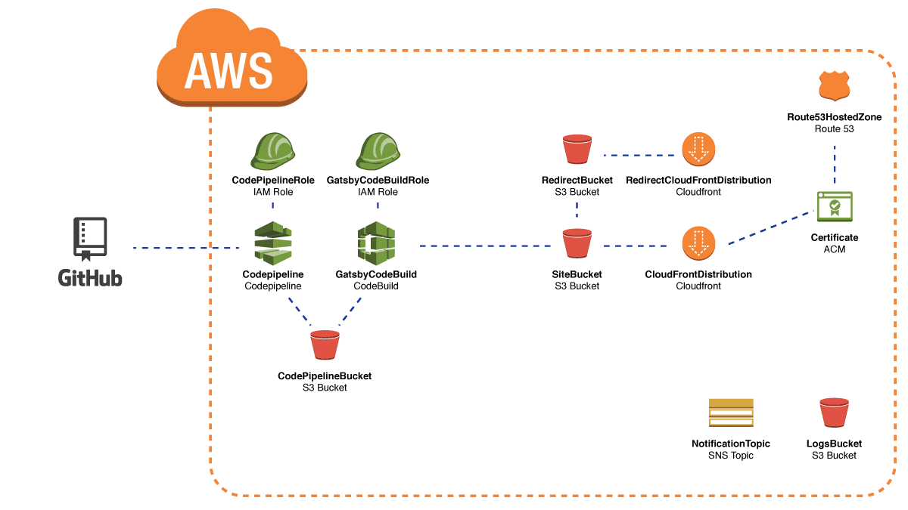

Finally I start blogging! This is not a simple blog but a blog powered by the so called latest technologies: react, gatsby, S3, CloudFront and the work flow is fully automated with GitHub and some related AWS services, such as CodePipeline, CodeBuild. So when I add new post and submit new content to GitHub, it will automatically trigger the build process and publish the new content to S3 and content will be distributed through AWS CloudFront, the CDN service from AWS. It is damn pretty cool, isn't it?

This website is hosted in AWS S3. The infrastructure behind my blog is created automatically with CloudFormation template with the inspiration from this GitHub project: https://github.com/velomash/aws-git-backed-gatsby-static-site

And the overall architecture is like blow:

And the content of blog is produced with Gatsby (https://www.gatsbyjs.org/), an blazing-fast static site generator for react. While I am learning React now, it also gives me the opportunity to practice what I have learn. I am sure this site will envole along my journey of learning new technologies.

By leveraging these new technologies, it allows me to focus on the content of my blog and all the dirty works are fully automated. I even designed a logo for this site. I am excited about my blog!

Moving forward I will blog my work and the adventure of my life in this site. Stay tuned!
